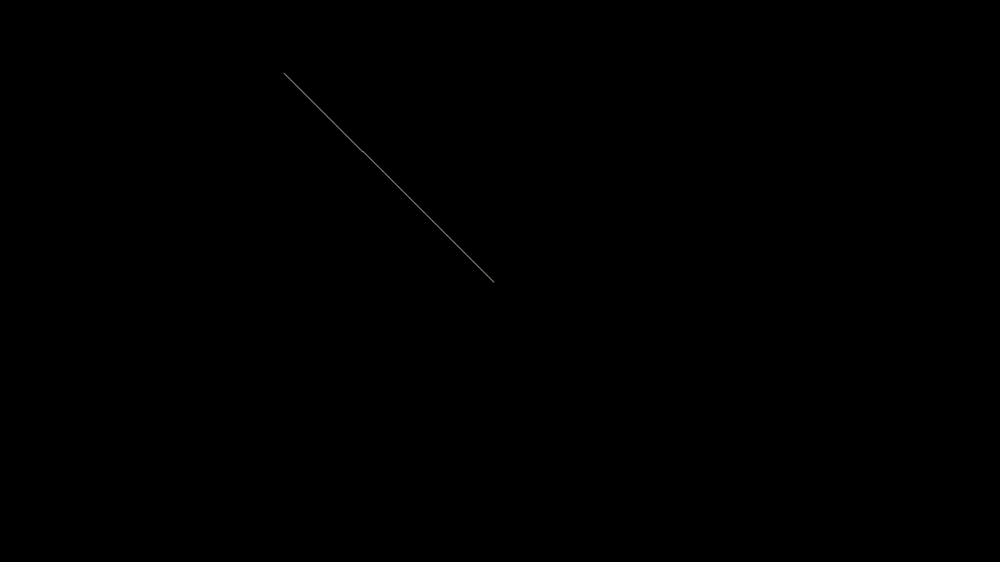

## Inverse Kinematics
I've implemented the FABRIK (Forward And Backward Reaching Inverse Kinematics) algorithm from this [paper](http://www.andreasaristidou.com/publications/papers/FABRIK.pdf). This was done more so as a fun little project rather than anything serious.

I hope to make this more complex, adding support for multiple end-effectors and so on as given within the paper.

### Example
